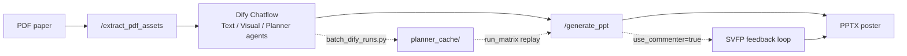

**English** | [简体中文](README.zh-CN.md)

# Paper-to-Poster Backend

> **Current version: v5.1** · FastAPI backend decoupled from a Dify paper-to-poster **Chatflow**, plus an offline **experiments** harness for reproducible paper evaluation.

Extract figures and text from PDFs, accept structured panel plans from Dify Planner agents, render editable PPTX posters, and optionally run an **SVFP visual feedback loop** (VLM scoring → structured repairs → archived traces). Long-running generation uses **async jobs with server-side long polling** for Dify compatibility.

**v5.1** adds a **Dify batch runner** (`batch_dify_runs.py`), version-controlled agent prompts under `dify/`, planner snapshot replay via `planner_cache/`, and a documented **L0→L8 experiment pipeline** ready for the full **30-paper** matrix.

---

## Version snapshot (v5.1)

| Area | Capability |
|------|------------|
| **Dify Chatflow** | Three-agent pipeline (Text Parse → Visual Parse → Planner); prompts in `dify/prompts/`; design doc in `dify/DIFY_WORKFLOW_AND_PAPER_DESIGN.md` |
| **Batch Dify runs** | `batch_dify_runs.py` uploads PDFs and triggers Chatflow via Dify API (`/v1/chat-messages`); self-hosted + Chatflow `type: custom` upload supported |
| **Planner replay** | Dify runs archived as `outputs/runs/.../input.json` → matched to PDFs → `experiments/datasets/planner_cache/<stem>.json` via `import_dify_runs.py` |
| **PDF assets** | `POST /extract_pdf_assets`: text preview + figures under `static/assets/{asset_token}/`, lightweight `image_url` by default |
| **PPT render** | 4 templates × 4 color themes; `image_focus` layout; vertical figure squash detection |
| **SVFP loop** | Structured issues/actions (incl. `figure_too_small`); `FeedbackApplier` routing; guards against horizontal layout regression |
| **Two-stage review** | Stage 1: Pillow preview + VLM/heuristics; Stage 2: LibreOffice PPTX→PNG (isolated profile per call) |
| **Run archive** | Each run under `outputs/runs/<timestamp>_<slug>_<runid>/` (`input.json`, `final.pptx`, `run_report.json`, optional `experiment_log.jsonl`) |
| **Async API** | `POST /generate_ppt` returns `job_id` (HTTP 202); `GET /jobs/{job_id}?wait=20` server long-poll for Dify |
| **Experiments** | 12 metrics × 5 baselines; matrix runner, metric judges, bootstrap stats (see `experiments/README.md`) |

**Evolution**

- **v4.1** (2026-05-19 – 05-23): SVFP protocol → unified run folders → LibreOffice stability → async jobs + long poll → layout quality
- **v5.0** (2026-05-24): experiments framework → JSONL telemetry → 5-paper pilot (3 baselines × 10 metrics)
- **v5.1** (2026-05-25 – 05-26): Dify batch automation → `dify/` prompts & design docs → **30 planner snapshots** → full experiment pipeline (L0–L8)

---

## End-to-end experiment pipeline (L0 → L8)

```
[L0] PDFs              experiments/datasets/papers/*.pdf
        │  batch_dify_runs.py  (Dify Chatflow trigger)
[L1] PosterTask draft  outputs/runs/<ts>_<slug>_<id>/input.json
        │  import_dify_runs.py  (title ↔ PDF matching)
[L2] Planner cache     experiments/datasets/planner_cache/<stem>.json   ← 30 cached
        │  build papers_30.json manifest
[L3] Paper manifest    experiments/configs/papers_30.json
        │  run_matrix.py  (30 papers × 3 baselines)
[L4] Artifacts         experiments/results/artifacts/<baseline>_<stem>/
        │  compute_metrics.py
[L5] Per-cell scores   experiments/results/metrics/
        │  aggregate_stats.py
[L6] Summary tables    experiments/results/aggregate/{aggregate,pairwise}.tsv
        │  plot_figures.py / print_paper_table.py
[L7–L8] Paper figures & tables
```

Detailed step-by-step commands: [`INTERNAL_EXPERIMENT_GUIDE.md`](INTERNAL_EXPERIMENT_GUIDE.md) (maintainer ops manual).

**Pilot results (n=5, v5.0)** — still valid as a sanity check:

| Metric | ours_svfp | ours_no_svfp | gpt4o_zeroshot |
|--------|-----------|--------------|----------------|
| B1 layout | **0.781** | 0.766 | 0.745 |
| B2 readability | **0.782** | 0.748 | 0.748 |
| D1 latency (ms) | 160,612 | **38** | 23,025 |

Full 30-paper numbers are produced locally after `run_matrix` + `compute_metrics` + `aggregate_stats` (results are gitignored).

---

## Workflow



1. **`/extract_pdf_assets`**: text preview and figure metadata (`include_images=false` for Dify).
2. **Dify Chatflow**: three agents parse text, analyze figure metadata, and emit a `PosterTask` JSON (see `dify/prompts/`).
3. **`/generate_ppt`**: async generation with optional SVFP loop; poll job, then download.
4. **Experiments**: replay frozen planner snapshots so all baselines share identical plans.

---

## Project layout

```
poster_agent_backend/
├── app/                         # Production FastAPI service
│   ├── main.py                  # Routes + async jobs (v5.1)
│   ├── models.py                # PosterTask schema (Dify ↔ renderer contract)
│   ├── pdf_assets.py            # PDF text & figure extraction
│   ├── ppt_renderer.py          # PPTX rendering
│   ├── feedback_loop.py         # SVFP loop + optional JSONL telemetry
│   └── ...
├── dify/                        # Dify Chatflow design & agent prompts
│   ├── DIFY_WORKFLOW_AND_PAPER_DESIGN.md
│   └── prompts/                 # text-parse / visual-parse / planner agents
├── experiments/                 # Offline batch evaluation
│   ├── baselines/               # ours_svfp, ours_no_svfp, gpt4o_zeroshot, …
│   ├── metrics/                 # A1–A4, B1–B3, C1–C3, D1–D3
│   ├── scripts/                 # batch_dify_runs, import_dify_runs, run_matrix, …
│   ├── datasets/
│   │   ├── papers/              # PDFs (gitignored)
│   │   └── planner_cache/       # Frozen PosterTask snapshots (committable)
│   └── tools/                   # experiment_logger, run_analysis
├── tests/
├── INTERNAL_EXPERIMENT_GUIDE.md # Full L0–L8 ops manual
├── requirements.txt
├── experiments/requirements.txt
└── .env.example
```

---

## Requirements

- **Python 3.12** recommended
- Optional: **LibreOffice** (`soffice`) for Stage 2 PPTX previews
- Optional: **DashScope API key** for Qwen-VL; heuristics fallback when unset
- For experiments: `pip install -r experiments/requirements.txt`
- For Dify batch runs: self-hosted or cloud Dify + `DIFY_API_KEY` in `.env`
- FastAPI must be reachable from Dify (e.g. `http://host.docker.internal:8000` on macOS Docker)

---

## Setup & run

```bash
cd poster_agent_backend
python3.12 -m venv .venv312
source .venv312/bin/activate
pip install -r requirements.txt
cp .env.example .env          # fill DASHSCOPE_API_KEY, DIFY_* if batching
python -m app.main
```

Health check: `curl http://127.0.0.1:8000/health`

---

## API reference

| Method | Path | Description |
|--------|------|-------------|
| `GET` | `/health` | Service status |
| `POST` | `/extract_pdf_assets` | Upload PDF or `pdf_url`; returns `asset_token` + figure URLs |
| `POST` | `/generate_ppt` | **Async** generation (202 + `job_id`); use with Dify |
| `GET` | `/jobs/{job_id}?wait=20` | Job status; `wait` 0–50s server long-poll |
| `POST` | `/generate_ppt_file` | **Sync** generation (local debugging) |
| `GET` | `/download/run/{run_folder}` | Download `final.pptx` |
| `GET` | `/assets/{asset_token}/{filename}` | Served extracted figures |

---

## Dify integration

### Chatflow architecture

| Agent | Prompt file | Role |
|-------|-------------|------|
| Text Parse | `dify/prompts/text-parseagent.txt` | Sections, bullets, key claims from `text_preview` |
| Visual Parse | `dify/prompts/visual-parseagent.txt` | Figure roles & panel hints from metadata-only figure list |
| Planner | `dify/prompts/planneragent.txt` | Template, theme, panels, figures → `PosterTask` JSON |

Read [`dify/DIFY_WORKFLOW_AND_PAPER_DESIGN.md`](dify/DIFY_WORKFLOW_AND_PAPER_DESIGN.md) for the full node topology and design rationale.

### Batch trigger (30 papers)

```bash
# 1. FastAPI running (terminal 1)
python -m app.main

# 2. Dry-run PDF selection (terminal 2)
python -m experiments.scripts.batch_dify_runs --limit 25 --skip-cached --dry-run

# 3. Run Chatflow for each PDF (~145 s/paper on M3 Mac)
python -m experiments.scripts.batch_dify_runs --limit 25 --skip-cached

# 4. Match runs → planner_cache
python -m experiments.scripts.import_dify_runs

# 5. Full experiment matrix
python -m experiments.scripts.run_matrix --papers experiments/configs/papers_30.json --baselines ours_svfp,ours_no_svfp,gpt4o_zeroshot
python -m experiments.scripts.compute_metrics --all
python -m experiments.scripts.aggregate_stats --out experiments/results/aggregate/
python -m experiments.scripts.print_paper_table
```

**Dify Chatflow upload note:** if the Start node variable `paper` is configured as **"Other file types"**, the API requires `"type": "custom"` (not `"document"`) — already handled in `batch_dify_runs.py`.

### Cloud / tunnel

For cloud Dify: `ngrok http 8000` or `cloudflared tunnel --url http://localhost:8000`, and point Chatflow HTTP nodes at the public URL.

Use **`POST /generate_ppt` + `GET /jobs/{job_id}`** polling — do not block a single HTTP call beyond ~60 s.

---

## Visual feedback loop (SVFP)

```json
{ "use_commenter": true, "max_iterations": 3 }
```

| Issue | Typical action |
|-------|----------------|
| `overlapping_elements` | Fewer bullets, smaller text |
| `empty_space` | Larger fonts, add content |
| `low_contrast` | Switch color theme |
| `figure_too_small` | Vertical panels → `image_focus` |

Per-run analysis:

```bash
python -m experiments.tools.run_analysis outputs/runs/<run_folder>/run_report.json
```

---

## Environment variables

| Variable | Default | Purpose |
|----------|---------|---------|
| `PORT` | `8000` | Server port |
| `OUTPUT_DIR` | `outputs` | Output root |
| `DASHSCOPE_API_KEY` | (empty) | Qwen-VL + some judges |
| `OPENAI_API_KEY` | (empty) | Metric judges (OpenAI-compatible) |
| `QWEN_VL_MODEL` | `Qwen/Qwen2.5-VL-7B-Instruct` | VLM model id |
| `POSTER_EXPERIMENT_MODE` | `1` via `python -m app.main` | JSONL telemetry; set `0` to disable |
| `DIFY_API_KEY` | (empty) | Chatflow app key (`app-…`) for batch runner |
| `DIFY_BASE_URL` | `http://localhost/v1` | Dify API base |
| `DIFY_WORKFLOW_INPUT_NAME` | `paper` | Start node PDF variable name |
| `DIFY_USER_ID` | `experiment-batch` | Dify user tag |
| `DIFY_QUERY` | (see `.env.example`) | Required chatflow `query` field |

---

## Tests

```bash
python -m pytest tests/ -q
python -m pytest experiments/tests/ -q
```

---

## GitHub commit notes

**Gitignored:** `.env`, `outputs/`, PDFs, `experiments/.cache/`, metrics/aggregate/artifacts, vendor baselines, debug PNGs.

**Committed:** source, `dify/prompts/`, `experiments/datasets/planner_cache/` (30 frozen planner snapshots), configs, tests, docs.
