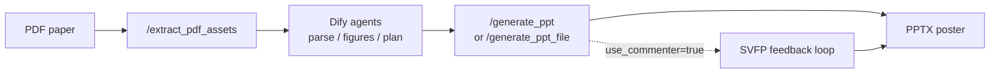

**English** | [简体中文](README.zh-CN.md)

# Paper-to-Poster Backend

> **Current version: v5.0** · FastAPI backend decoupled from a Dify paper-to-poster workflow, plus an offline **experiments** harness for paper evaluation.

Extract figures and text from PDFs, accept structured panel plans from Dify Planner agents, render editable PPTX posters, and optionally run an **SVFP visual feedback loop** (VLM scoring → structured repairs → archived traces). Long-running generation uses **async jobs with server-side long polling** for Dify compatibility.

**v5.0** adds a full batch evaluation pipeline (12 metrics × 5 baselines), optional per-run JSONL telemetry, and a completed **pilot run on 5 papers** (ours_svfp vs ours_no_svfp vs gpt4o_zeroshot).

---

## Version snapshot (v5.0)

| Area | Capability |
|------|------------|
| **PDF assets** | `POST /extract_pdf_assets`: text preview + figures under `static/assets/{asset_token}/`, lightweight `image_url` by default |
| **PPT render** | 4 templates × 4 color themes; `image_focus` layout; vertical figure squash detection |
| **SVFP loop** | Structured issues/actions (incl. `figure_too_small`); `FeedbackApplier` routing; guards against horizontal layout regression |
| **Two-stage review** | Stage 1: fast Pillow preview + VLM/heuristics; Stage 2: LibreOffice PPTX→PNG (isolated profile per call) |
| **Run archive** | Each run under `outputs/runs/<timestamp>_<slug>_<runid>/` (`input.json`, `final.pptx`, `run_report.json`, optional `experiment_log.jsonl`) |
| **Async API** | `POST /generate_ppt` returns `job_id` (HTTP 202); `GET /jobs/{job_id}?wait=20` long-polls on the server for Dify loop nodes |
| **Experiment telemetry** | When `POSTER_EXPERIMENT_MODE=1`, SVFP stages emit JSONL events (latency, VLM tokens, soffice status); when off, only a single `None` check — zero production overhead |
| **Downloads** | `GET /download/run/{run_folder}` serves `final.pptx` with a human-readable filename from the paper title |
| **Experiments** | `experiments/`: 12 metrics, 5 baselines, judge modules, matrix runner + stats (see `experiments/README.md`) |

**Evolution**

- **v4.1** (2026-05-19 – 05-23): SVFP protocol → unified run folders → LibreOffice stability → async jobs + long poll → layout quality (`image_focus` + anti-regression guards)
- **v5.0** (2026-05-24): experiments framework → production/eval decoupling → optional JSONL telemetry → 5-paper pilot (3 baselines × 10 metrics)

---

## Pilot results (n=5)

Completed on 5 Dify-uploaded papers comparing `ours_svfp` / `ours_no_svfp` / `gpt4o_zeroshot`. The full 30-paper matrix uses `experiments/configs/papers_30.json` (PDFs not included — prepare locally).

| Metric | ours_svfp | ours_no_svfp | gpt4o_zeroshot | Takeaway |
|--------|-----------|--------------|----------------|----------|
| **B1 layout rationality** | **0.781** | 0.766 | 0.745 | SVFP loop yields the clearest layout gains |
| **B2 readability** | **0.782** | 0.748 | 0.748 | Feedback iterations improve typography and whitespace |
| **A1 information retention** | 0.448 | 0.448 | 0.544 | Content planning still has headroom on this small set |
| **A3 hallucination** | 0.117 | **0.100** | 0.117 | All three-column close |
| **D1 latency (ms)** | 160,612 | **38** | 23,025 | SVFP trades time for layout quality |
| **D2 cost ($)** | 0.012 | **0** | 0.004 | Multi-round VLM calls add API cost |

Reproduce aggregate tables:

```bash
python -m experiments.scripts.run_matrix --papers experiments/configs/papers_5.json --baselines ours_svfp,ours_no_svfp,gpt4o_zeroshot
python -m experiments.scripts.compute_metrics --all
python -m experiments.scripts.aggregate_stats --out experiments/results/aggregate/
python -m experiments.scripts.print_paper_table
```

> Raw metrics / aggregate TSV and LLM caches are gitignored — regenerate locally after clone.

---

## Workflow



1. **`/extract_pdf_assets`**: text preview and figure metadata (`include_images=false` for Dify to avoid huge base64).
2. **Dify**: parse text, analyze figures, build `panels` / `figures` / template and theme.
3. **`/generate_ppt`** (recommended for Dify): async generation, poll job, then download.
4. **`/generate_ppt_file`** (local debug): synchronous full pipeline with feedback trace in the response.

---

## Project layout

```
poster_agent_backend/
├── app/                         # Production FastAPI service (no reverse deps from experiments)
│   ├── main.py                  # Routes + async jobs (v5.0)
│   ├── pdf_assets.py            # PDF text & figure extraction
│   ├── ppt_renderer.py          # PPTX rendering
│   ├── feedback_loop.py         # SVFP loop + optional experiment telemetry
│   ├── vlm_commenter.py         # SVFP protocol + Qwen-VL review
│   ├── job_store.py             # In-memory async job state
│   ├── run_archive.py           # Run folder archival
│   └── ...
├── experiments/                 # Offline batch evaluation (see experiments/README.md)
│   ├── baselines/               # ours_svfp, ours_no_svfp, gpt4o_zeroshot, …
│   ├── metrics/                 # A1–A4, B1–B3, C1–C3, D1–D3
│   ├── judges/                  # NLI / VLM / PaperQuiz judges
│   ├── scripts/                 # run_matrix, compute_metrics, aggregate_stats
│   ├── configs/                 # YAML + papers_5.json / papers_30.json
│   ├── datasets/                # planner_cache (Dify plans, committable)
│   └── tools/                   # experiment_logger, run_analysis (moved from app/)
├── tests/                       # SVFP unit tests
├── static/assets/               # Runtime extracted figures (gitignored)
├── outputs/runs/                # Per-run archives (gitignored)
├── requirements.txt
├── experiments/requirements.txt # Extra deps for eval (pandas, scipy, matplotlib)
└── .env.example
```

---

## Requirements

- **Python 3.12** recommended (3.13 may force PyMuPDF source builds on macOS)
- Optional: **LibreOffice** (`soffice`) for Stage 2 real PPTX previews
- Optional: **DashScope API key** for Qwen-VL; heuristics used when unset
- For experiments: `pip install -r experiments/requirements.txt` plus `OPENAI_API_KEY` / `DASHSCOPE_API_KEY` for judges and LLM baselines

---

## Setup & run

```bash
cd poster_agent_backend
python3.12 -m venv .venv312
source .venv312/bin/activate   # Windows: .venv312\Scripts\activate
pip install -r requirements.txt
cp .env.example .env
python -m app.main
```

Health check:

```bash
curl http://127.0.0.1:8000/health
```

---

## API reference

| Method | Path | Description |
|--------|------|-------------|
| `GET` | `/health` | Service status |
| `POST` | `/extract_pdf_assets` | Upload PDF or `pdf_url`; returns `asset_token` + figure URLs |
| `POST` | `/generate_ppt` | **Async** generation (202 + `job_id`); use with Dify |
| `GET` | `/jobs/{job_id}?wait=20` | Job status; `wait` 0–50s server long-poll until terminal state |
| `POST` | `/generate_ppt_file` | **Sync** generation (local debugging) |
| `GET` | `/download/run/{run_folder}` | Download `final.pptx` (filename from poster title) |
| `GET` | `/assets/{asset_token}/{filename}` | Served extracted figures |

---

## Quick tests

### Extract PDF assets

```bash
curl -X POST "http://127.0.0.1:8000/extract_pdf_assets" \
  -F "file=@/path/to/paper.pdf"
```

### Async generation (Dify)

```bash
curl -X POST "http://127.0.0.1:8000/generate_ppt" \
  -H "Content-Type: application/json" \
  -d @tests/test_payload_feedback.json

curl "http://127.0.0.1:8000/jobs/<job_id>?wait=30"

curl -OJ "http://127.0.0.1:8000/download/run/<run_folder>"
```

### Sync generation (local)

```bash
curl -X POST "http://127.0.0.1:8000/generate_ppt_file" \
  -H "Content-Type: application/json" \
  -d @tests/test_payload_feedback.json
```

---

## Visual feedback loop (SVFP)

Enable in the Planner JSON:

```json
{
  "use_commenter": true,
  "max_iterations": 3
}
```

**Two stages**

- **Stage 1**: Pillow preview PNG → structured VLM feedback (SVFP) or heuristic fallback
- **Stage 2**: If LibreOffice is installed, render the real PPTX to PNG and review again

**SVFP issue types**

| Issue | Typical action |
|-------|----------------|
| `overlapping_elements` | Fewer bullets, smaller text |
| `empty_space` | Larger fonts, add content |
| `low_contrast` | Switch color theme |
| `figure_too_small` | Vertical panels → `image_focus`; ignored on horizontal layouts to avoid regression |

**Per-run analysis** (ablations / debugging):

```bash
python -m experiments.tools.run_analysis outputs/runs/<run_folder>/run_report.json
```

---

## Experiments

Full docs: [`experiments/README.md`](experiments/README.md).

**12 metrics**

| Category | IDs | Description |
|----------|-----|-------------|
| Content | A1–A4 | Information retention, figure-text alignment, hallucination, section coverage |
| Visual | B1–B3 | Layout rationality, readability, academic compliance |
| User | C1–C3 | PaperQuiz, SUS, time-saving (requires user-study CSVs) |
| Engineering | D1–D3 | Latency, cost, failure rate |

**5 baselines**: `ours_svfp` · `ours_no_svfp` · `gpt4o_zeroshot` · `paper2poster` · `posteragent` (external SOTA baselines need `experiments/baselines/bootstrap_vendor.sh`)

**Minimal smoke test**:

```bash
pip install -r experiments/requirements.txt
python -m experiments.scripts.run_one_paper \
  --paper experiments/datasets/papers/<paper>.pdf \
  --baseline ours_svfp
python -m experiments.scripts.compute_metrics --artifact experiments/results/artifacts/_smoke --metrics all
```

---

## Templates & themes

```json
{
  "template": "template_dashboard",
  "color_theme": "academic_blue",
  "layout_variant": "auto",
  "emphasis_level": "normal"
}
```

| Template | Best for |
|----------|----------|
| `template_dashboard` | Six-zone dashboard; methods / benchmarks |
| `template_classic` | Balanced columns; standard experiment papers |
| `template_storyflow` | Horizontal six-step narrative; pipelines / systems |
| `template_minimal` | High whitespace cards; concepts / surveys |

**Themes**: `academic_blue`, `engineering_green`, `warm_orange`, `minimal_gray`

---

## Environment variables

| Variable | Default | Purpose |
|----------|---------|---------|
| `PORT` | `8000` | Server port |
| `OUTPUT_DIR` | `outputs` | Output root |
| `DASHSCOPE_API_KEY` | (empty) | DashScope for Qwen-VL |
| `QWEN_VL_MODEL` | `Qwen/Qwen2.5-VL-7B-Instruct` | VLM model id |
| `POSTER_EXPERIMENT_MODE` | `1` when using `python -m app.main` | Enable JSONL telemetry; set `0` to disable |
| `POSTER_EXPERIMENT_LOG` | (empty, auto per run dir) | Telemetry JSONL path |

---

## Dify (cloud)

Expose the local server, e.g. `ngrok http 8000` or `cloudflared tunnel --url http://localhost:8000`, and point Dify HTTP nodes at the public URL.

Use **`POST /generate_ppt` + `GET /jobs/{job_id}`** polling instead of blocking on a single HTTP call (>60s feedback loops cause Dify retries and duplicate runs).

---

## Tests

```bash
# Production path
python -m pytest tests/ -q

# Experiments framework
python -m pytest experiments/tests/ -q
```

---

## GitHub commit notes

The following are **gitignored** and will not be pushed:

- `.env`, virtualenvs, `.pytest_cache`
- `outputs/`, `static/assets/`, local debug PNGs
- Experiment PDFs, `experiments/.cache/`, metrics/aggregate/artifacts results
- External baseline vendor (`experiments/baselines/_vendor/`)

**Committed**: source code, `experiments/configs/`, `experiments/datasets/planner_cache/` (Dify planner cache), `tests/`, documentation.
