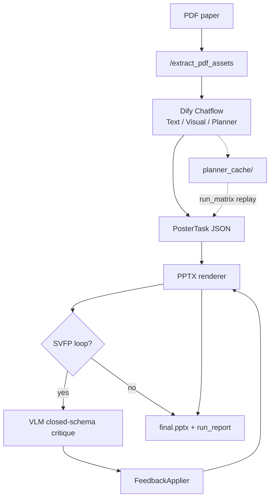

**English** | [简体中文](README.zh-CN.md)

# PosterCSP — Paper-to-Poster Backend

> **Current version: v5.2** · FastAPI backend + **SVFP** (Structured Visual Feedback Protocol) + reproducible **CS-Poster-30** evaluation harness.

Given a CS paper PDF, the system produces an editable A3 conference poster PPTX through a Dify **Chatflow** (content planning) and a Python renderer with an optional **SVFP closed-loop** (VLM critique → deterministic repair → convergence trace). Long-running jobs use **async HTTP + server-side long polling** for Dify compatibility.

**Research framing (v2):** one primary contribution (**SVFP protocol**), two secondary ones (**CS-Poster-30 benchmark** + **CS vertical instantiation**). See [`RESEARCH_DIRECTION_v2.md`](RESEARCH_DIRECTION_v2.md) for the full pivot rationale after the 5-paper pilot.

---

## What this project is (and is not)

| | |
|---|---|
| **Is** | A **planner-agnostic** structured visual feedback protocol (4 issue types × 9 atomic actions) that can plug into any poster planner |
| **Is** | A reproducible **CS-Poster-30** pipeline (30 frozen planner snapshots, 12-metric suite, L0→L8 scripts) |
| **Is not** | A claim that structured planning beats zero-shot on **content recall** (pilot: a1 lower than gpt4o_zeroshot) |
| **Is not** | A lightweight system (pilot: SVFP ~160 s vs 38 ms no-feedback vs 23 s zero-shot) |
| **Is not** | Proof of 100 % figure reuse until the figure pipeline is fully audited (B1 in progress) |

**One-line pitch (paper):**

> We propose **SVFP** — constraining VLM visual critique to a closed `{4 issues × 9 actions}` schema with a deterministic `FeedbackApplier`, yielding executable, convergent layout repairs. On CS-Poster-30, SVFP shows large-effect gains on visual quality (B1/B2, Cohen's d ≈ 1.8 at n=5) while honestly reporting a content precision–recall trade-off.

---

## Version snapshot (v5.2)

| Area | Capability |
|------|------------|
| **SVFP protocol** | 4 root-cause issues × 9 deterministic actions (`vlm_commenter.py`); FSM-style convergence (`feedback_loop.py`); layout-only repairs (content bullets unchanged by design) |
| **E1 baseline** | `ours_freeform` — free-text VLM critique + LLM best-effort apply (closed-set vs free-form ablation) |
| **A3 fix** | NLI hallucination: neutral/abstain no longer counted as hallucination; split `contradicted_rate` vs `unsupported_rate` |
| **Figure audit** | `audit_figures.py` — VLM alignment scan for planner_cache figure pollution (B1 diagnostic) |
| **Planner cache** | 30 frozen `PosterTask` snapshots; cleaned figure refs; `clean_planner_cache.py` + `import_dify_runs.py` |
| **Dify Chatflow** | Three-agent pipeline; prompts in `dify/prompts/`; design in `dify/DIFY_WORKFLOW_AND_PAPER_DESIGN.md` |
| **Batch Dify** | `batch_dify_runs.py` triggers Chatflow via API for scale runs |
| **Renderer** | 4 templates × 4 themes; six-panel CS domain prior; async jobs + run archive |
| **Experiments** | Baselines: `ours_svfp` · `ours_no_svfp` · `ours_freeform` · `gpt4o_zeroshot` · external SOTA (optional) |

**Evolution**

- **v4.1**: SVFP protocol, async jobs, layout quality guards
- **v5.0**: experiments framework, 5-paper pilot, JSONL telemetry
- **v5.1**: Dify batch automation, 30 planner snapshots, L0→L8 pipeline docs
- **v5.2**: research re-anchor (PosterCSP / SVFP spine), E1 free-form baseline, A3 metric fix, figure audit + planner cache cleanup

---

## Pilot findings (n=5, honest summary)

Aggregated from 15 metric JSON files (5 papers × 3 baselines). **None survive BH-FDR correction at n=5** — treat as directional only.

| Cluster | Metric | gpt4o_zeroshot | ours_no_svfp | ours_svfp | Reading |
|---------|--------|----------------|--------------|-----------|---------|
| Content | A1 retention | **0.544** | 0.448 | 0.448 | Structured planner sacrifices recall |
| Content | A3 hallucination | 0.117 | **0.100** | 0.117 | No clear winner (A3 logic fixed in v5.2) |
| Visual | B1 layout | 0.745 | 0.766 | **0.781** | SVFP's clearest gain |
| Visual | B2 readability | 0.748 | 0.748 | **0.782** | Same pattern as B1 |
| Engineering | D1 latency (ms) | 23,025 | **38** | 160,612 | Quality–latency trade-off |
| Engineering | D2 cost ($) | **0.004** | 0 | 0.012 | Multi-round VLM cost |

**Key design fact:** `ours_svfp` vs `ours_no_svfp` differs only in `use_commenter` — all repairs are layout-only, so content metrics are identical between them by construction.

**Next experiments (backlog):** E1 three-arm (no-feedback / free-form / SVFP), E4 n=30 matrix, B1 figure pipeline fix. Full backlog in [`RESEARCH_DIRECTION_v2.md`](RESEARCH_DIRECTION_v2.md).

---

## Architecture



1. **`/extract_pdf_assets`** — text preview + figure metadata (lightweight URLs for Dify).
2. **Dify Chatflow** — three agents emit a `PosterTask` JSON.
3. **Renderer + optional SVFP** — deterministic layout repair loop.
4. **Experiments** — replay frozen planner snapshots; compare baselines on identical plans.

---

## Project layout

```
poster_agent_backend/
├── app/                         # Production FastAPI + SVFP + renderer
├── dify/                        # Chatflow design & agent prompts
├── experiments/
│   ├── baselines/               # ours_svfp, ours_no_svfp, ours_freeform, gpt4o_zeroshot, …
│   ├── metrics/                 # A1–A4, B1–B3, C1–C3, D1–D3
│   ├── scripts/                 # batch_dify_runs, run_matrix, audit_figures, …
│   └── datasets/planner_cache/  # 30 frozen PosterTask snapshots
├── RESEARCH_DIRECTION_v2.md     # Research pivot & experiment backlog (read this)
├── INTERNAL_EXPERIMENT_GUIDE.md # L0→L8 step-by-step ops manual
└── .env.example
```

---

## Quick start

```bash
cd poster_agent_backend
python3.12 -m venv .venv312 && source .venv312/bin/activate
pip install -r requirements.txt
cp .env.example .env          # DASHSCOPE_API_KEY, DIFY_* for batch runs
python -m app.main
curl http://127.0.0.1:8000/health
```

---

## API reference

| Method | Path | Description |
|--------|------|-------------|
| `GET` | `/health` | Service status |
| `POST` | `/extract_pdf_assets` | PDF → `asset_token` + figure URLs |
| `POST` | `/generate_ppt` | Async generation (202 + `job_id`) |
| `GET` | `/jobs/{job_id}?wait=20` | Long-poll job status |
| `POST` | `/generate_ppt_file` | Sync generation (debug) |
| `GET` | `/download/run/{run_folder}` | Download `final.pptx` |
| `GET` | `/assets/{asset_token}/{filename}` | Extracted figures |

---

## SVFP protocol

Enable in Planner JSON:

```json
{ "use_commenter": true, "max_iterations": 3 }
```

| Issue | Typical deterministic action |
|-------|------------------------------|
| `overlapping_elements` | Reduce bullets, shrink font |
| `empty_space` | Enlarge font, rebalance whitespace |
| `low_contrast` | Switch palette (2-color guard) |
| `figure_too_small` | Vertical panels → `image_focus` |

Per-run trace analysis:

```bash
python -m experiments.tools.run_analysis outputs/runs/<run_folder>/run_report.json
```

---

## Experiments

**Baselines**

| Name | What it isolates |
|------|------------------|
| `ours_svfp` | Full SVFP closed-loop |
| `ours_no_svfp` | Same renderer, no feedback (layout ablation) |
| `ours_freeform` | Free-text VLM critique + LLM apply (E1 arm) |
| `gpt4o_zeroshot` | LLM planner only, same renderer & template |

**Full matrix (local)**

```bash
python -m experiments.scripts.run_matrix \
  --papers experiments/configs/papers_30.json \
  --baselines ours_svfp,ours_no_svfp,ours_freeform,gpt4o_zeroshot
python -m experiments.scripts.compute_metrics --all
python -m experiments.scripts.aggregate_stats --out experiments/results/aggregate/
python -m experiments.scripts.print_paper_table
```

**Figure audit (B1 diagnostic)**

```bash
python experiments/scripts/audit_figures.py --dry-run   # no API calls
python experiments/scripts/audit_figures.py --limit 3   # smoke
```

Details: [`experiments/README.md`](experiments/README.md) · [`INTERNAL_EXPERIMENT_GUIDE.md`](INTERNAL_EXPERIMENT_GUIDE.md)

---

## Environment variables

| Variable | Purpose |
|----------|---------|
| `DASHSCOPE_API_KEY` | Qwen-VL critic + judges |
| `OPENAI_API_KEY` | Metric judges (OpenAI-compatible) |
| `POSTER_EXPERIMENT_MODE` | `1` = JSONL telemetry per run |
| `DIFY_API_KEY` / `DIFY_BASE_URL` | Batch Chatflow trigger |
| `DIFY_WORKFLOW_INPUT_NAME` | Start node PDF variable (default `paper`) |

See [`.env.example`](.env.example) for the full list.

---

## Tests

```bash
python -m pytest tests/ -q
python -m pytest experiments/tests/ -q
```

---

## Documentation map

| Doc | Audience | Content |
|-----|----------|---------|
| **README** (this file) | New clones | Overview, quick start, honest pilot summary |
| [`RESEARCH_DIRECTION_v2.md`](RESEARCH_DIRECTION_v2.md) | Paper authors | Positioning, metric v2, experiment backlog |
| [`INTERNAL_EXPERIMENT_GUIDE.md`](INTERNAL_EXPERIMENT_GUIDE.md) | Operators | L0→L8 commands, pitfalls |
| [`dify/DIFY_WORKFLOW_AND_PAPER_DESIGN.md`](dify/DIFY_WORKFLOW_AND_PAPER_DESIGN.md) | Method section | Chatflow topology & agent design |

---

## GitHub notes

**Gitignored:** `.env`, `outputs/`, PDFs, `experiments/.cache/`, metrics/aggregate/artifacts, `PAPER_DRAFT_v0.md`, internal conversation logs.

**Committed:** source, `dify/prompts/`, `planner_cache/` (30 snapshots), `RESEARCH_DIRECTION*.md`, configs, tests.
