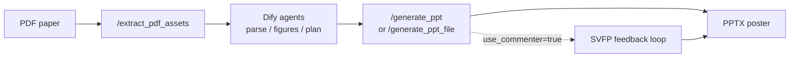

**English** | [简体中文](README.zh-CN.md)

# Paper-to-Poster Backend

> **Current version: v4.1** · FastAPI backend decoupled from a Dify paper-to-poster workflow.

Extract figures and text from PDFs, accept structured panel plans from Dify Planner agents, render editable PPTX posters, and optionally run an **SVFP visual feedback loop** (VLM scoring → structured repairs → archived traces). Long-running generation uses **async jobs with server-side long polling** for Dify compatibility.

---

## Version snapshot (v4.1)

| Area | Capability |
|------|------------|
| **PDF assets** | `POST /extract_pdf_assets`: text preview + figures under `static/assets/{asset_token}/`, lightweight `image_url` by default |
| **PPT render** | 4 templates × 4 color themes; `image_focus` layout; vertical figure squash detection |
| **SVFP loop** | Structured issues/actions (incl. `figure_too_small`); `FeedbackApplier` routing; guards against horizontal layout regression |
| **Two-stage review** | Stage 1: fast Pillow preview + VLM/heuristics; Stage 2: LibreOffice PPTX→PNG (isolated profile per call, fixes `soffice exit=-6`) |
| **Run archive** | Each run under `outputs/runs/<timestamp>_<slug>_<runid>/` (`input.json`, `final.pptx`, `run_report.json`, iteration previews) |
| **Async API** | `POST /generate_ppt` returns `job_id` (HTTP 202); `GET /jobs/{job_id}?wait=20` long-polls on the server for Dify loop nodes without sleep |
| **Downloads** | `GET /download/run/{run_folder}` serves `final.pptx` with a human-readable filename from the paper title |

Evolution (2026-05-19 – 05-23): SVFP protocol → unified run folders → demo cleanup → LibreOffice stability → async jobs + long poll → remove placeholder UI → readable download names → **layout quality** (`image_focus` + anti-regression guards). See `PROJECT_CONVERSATION_SUMMARY.md` in the repo.

---

## Workflow



1. **`/extract_pdf_assets`**: text preview and figure metadata (`include_images=false` for Dify to avoid huge base64).
2. **Dify**: parse text, analyze figures, build `panels` / `figures` / template and theme.
3. **`/generate_ppt`** (recommended for Dify): async generation, poll job, then download.
4. **`/generate_ppt_file`** (local debug): synchronous full pipeline with feedback trace in the response.

---

## Project layout

```
poster_agent_backend/
├── app/
│   ├── main.py              # FastAPI routes (v4.1)
│   ├── pdf_assets.py        # PDF text & figure extraction
│   ├── ppt_renderer.py      # PPTX rendering (templates / themes / image_focus)
│   ├── feedback_loop.py     # Visual feedback loop + LibreOffice snapshots
│   ├── vlm_commenter.py     # SVFP protocol + Qwen-VL review
│   ├── job_store.py         # In-memory async job state (per process)
│   ├── run_archive.py       # Run folder archival
│   ├── run_analysis.py      # CLI to analyze run_report.json
│   └── ...
├── tests/
├── static/assets/
├── outputs/runs/
├── requirements.txt
└── .env.example
```

---

## Requirements

- **Python 3.12** recommended (3.13 may force PyMuPDF source builds on macOS)
- Optional: **LibreOffice** (`soffice`) for Stage 2 real PPTX previews
- Optional: **DashScope API key** for Qwen-VL; heuristics used when unset or unavailable

---

## Setup & run

```bash
cd poster_agent_backend
python3.12 -m venv .venv312
source .venv312/bin/activate   # Windows: .venv312\Scripts\activate
pip install -r requirements.txt
cp .env.example .env
python -m app.main
```

Health check:

```bash
curl http://127.0.0.1:8000/health
```

---

## API reference

| Method | Path | Description |
|--------|------|-------------|
| `GET` | `/health` | Service status |
| `POST` | `/extract_pdf_assets` | Upload PDF or `pdf_url`; returns `asset_token` + figure URLs |
| `POST` | `/generate_ppt` | **Async** generation (202 + `job_id`); use with Dify |
| `GET` | `/jobs/{job_id}?wait=20` | Job status; `wait` 0–50s server long-poll until terminal state |
| `POST` | `/generate_ppt_file` | **Sync** generation (local debugging) |
| `GET` | `/download/run/{run_folder}` | Download `final.pptx` (filename from poster title) |
| `GET` | `/assets/{asset_token}/{filename}` | Served extracted figures |

---

## Quick tests

### Extract PDF assets

```bash
curl -X POST "http://127.0.0.1:8000/extract_pdf_assets" \
  -F "file=@/path/to/paper.pdf"
```

With default `include_images=false`, images live under `static/assets/{asset_token}/`; the JSON response only includes URLs.

### Async generation (Dify)

```bash
curl -X POST "http://127.0.0.1:8000/generate_ppt" \
  -H "Content-Type: application/json" \
  -d @tests/test_payload_feedback.json

curl "http://127.0.0.1:8000/jobs/<job_id>?wait=30"

curl -OJ "http://127.0.0.1:8000/download/run/<run_folder>"
```

### Sync generation (local)

```bash
curl -X POST "http://127.0.0.1:8000/generate_ppt_file" \
  -H "Content-Type: application/json" \
  -d @tests/test_payload_feedback.json
```

---

## Visual feedback loop (SVFP)

Enable in the Planner JSON:

```json
{
  "use_commenter": true,
  "max_iterations": 3
}
```

**Two stages**

- **Stage 1**: Pillow preview PNG → structured VLM feedback (SVFP) or heuristic fallback
- **Stage 2**: If LibreOffice is installed, render the real PPTX to PNG and review again

**SVFP issue types**

| Issue | Typical action |
|-------|----------------|
| `overlapping_elements` | Fewer bullets, smaller text |
| `empty_space` | Larger fonts, add content |
| `low_contrast` | Switch color theme |
| `figure_too_small` | Vertical panels → `image_focus`; ignored on horizontal layouts to avoid regression |

Without `DASHSCOPE_API_KEY` or when the VLM fails, heuristics cover overflow, density, empty space, and figure/layout mismatch.

**Run analysis** (experiments / ablations):

```bash
python -m app.run_analysis outputs/runs/<run_folder>/run_report.json
```

---

## Templates & themes

```json
{
  "template": "template_dashboard",
  "color_theme": "academic_blue",
  "layout_variant": "auto",
  "emphasis_level": "normal"
}
```

| Template | Best for |
|----------|----------|
| `template_dashboard` | Six-zone dashboard; methods / benchmarks |
| `template_classic` | Balanced columns; standard experiment papers |
| `template_storyflow` | Horizontal six-step narrative; pipelines / systems |
| `template_minimal` | High whitespace cards; concepts / surveys |

**Themes**: `academic_blue`, `engineering_green`, `warm_orange`, `minimal_gray`

**Panel `layout_hint`**: `text_only`, `text_top_image_bottom`, `text_left_image_right`, `image_focus`, `image_compact`, etc.; the feedback loop mutates hints and `body_font_scale`.

---

## Environment variables

| Variable | Default | Purpose |
|----------|---------|---------|
| `PORT` | `8000` | Server port |
| `OUTPUT_DIR` | `outputs` | Output root |
| `DASHSCOPE_API_KEY` | (empty) | DashScope for Qwen-VL |
| `QWEN_VL_MODEL` | `Qwen/Qwen2.5-VL-7B-Instruct` | VLM model id |

---

## Dify (cloud)

Expose the local server, e.g. `ngrok http 8000` or `cloudflared tunnel --url http://localhost:8000`, and point Dify HTTP nodes at the public URL.

Use **`POST /generate_ppt` + `GET /jobs/{job_id}`** polling instead of blocking on a single HTTP call (>60s feedback loops cause Dify retries and duplicate runs).

Completed jobs expose `download_url`, `filename`, `best_score`, `iterations`, `converged`, and `convergence_reason`.

---

## Tests

```bash
python -m pytest tests/ -q
```
