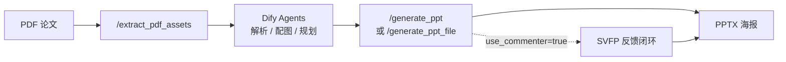

[English](README.md) | **简体中文**

# Paper-to-Poster Backend

> **当前版本：v5.0** · FastAPI 后端，为 Dify「论文 → 学术海报」工作流提供解耦服务，并附带离线 **实验评测** 框架。

从 PDF 提取图文素材，接收 Dify Planner 的结构化面板规划，渲染可编辑的 PPTX 海报；可选 **SVFP 视觉反馈闭环**（VLM 评分 → 结构化修复 → 收敛留痕），并针对 Dify 长耗时场景提供 **异步 Job + 长轮询**。

**v5.0** 新增完整批量评测流水线（12 项指标 × 5 条基线）、可选的运行遥测 JSONL，以及 **5 篇论文的试点实验**（ours_svfp vs ours_no_svfp vs gpt4o_zeroshot）。

---

## 版本概览（v5.0）

| 模块 | 能力 |
|------|------|
| **PDF 资产** | `POST /extract_pdf_assets`：文本预览 + 插图提取，默认落盘 `static/assets/{asset_token}/`，返回轻量 `image_url` |
| **PPT 渲染** | 4 套模板 × 4 套配色；支持 `image_focus` 图主导布局、纵向挤压检测 |
| **SVFP 闭环** | 结构化 issue/action（含 `figure_too_small`）；`FeedbackApplier` 路由修复；防横向布局退化 |
| **双阶段评审** | Stage 1：Pillow 快速预览 + VLM/启发式；Stage 2：LibreOffice 真 PPTX 截图再评（独立 profile） |
| **运行归档** | 单次运行写入 `outputs/runs/<timestamp>_<slug>_<runid>/`（`input.json`、`final.pptx`、`run_report.json`、可选 `experiment_log.jsonl`） |
| **异步接口** | `POST /generate_ppt` 立即返回 `job_id`（HTTP 202）；`GET /jobs/{job_id}?wait=20` 服务端长轮询 |
| **实验遥测** | `POSTER_EXPERIMENT_MODE=1` 时，SVFP 各阶段写入 JSONL（耗时、VLM token、soffice 状态）；关闭时仅一次 `None` 判断，生产零开销 |
| **下载体验** | `GET /download/run/{run_folder}` 按论文标题生成可读文件名 |
| **实验框架** | `experiments/`：12 项指标、5 条基线、Judge 模块、矩阵跑批与统计聚合（详见 `experiments/README.md`） |

**演进主线**

- **v4.1**（2026-05-19 ~ 05-23）：SVFP 协议 → 输出目录统一 → LibreOffice 稳定性 → 异步 Job + 长轮询 → 布局质量收敛（`image_focus` + 防反馈退化）
- **v5.0**（2026-05-24）：实验框架落地 → 生产代码与评测解耦 → 可选 JSONL 遥测 → 5 篇论文试点跑通（3 基线 × 10 指标）

---

## 试点实验结果（n=5）

在 5 篇 Dify 上传论文上完成 `ours_svfp` / `ours_no_svfp` / `gpt4o_zeroshot` 对比（完整 30 篇矩阵见 `experiments/configs/papers_30.json`，需自行准备 PDF）。

| 指标 | ours_svfp | ours_no_svfp | gpt4o_zeroshot | 解读 |
|------|-----------|--------------|----------------|------|
| **B1 布局合理性** | **0.781** | 0.766 | 0.745 | SVFP 闭环带来最明显布局提升 |
| **B2 可读性** | **0.782** | 0.748 | 0.748 | 反馈迭代改善字号与留白 |
| **A1 信息保留** | 0.448 | 0.448 | 0.544 | 小样本下内容规划仍有空间 |
| **A3 幻觉率** | 0.117 | **0.100** | 0.117 | 三条基线接近 |
| **D1 延迟 (ms)** | 160,612 | **38** | 23,025 | SVFP 以时间换布局质量 |
| **D2 成本 ($)** | 0.012 | **0** | 0.004 | VLM 多轮调用增加 API 成本 |

复现聚合表：

```bash
python -m experiments.scripts.run_matrix --papers experiments/configs/papers_5.json --baselines ours_svfp,ours_no_svfp,gpt4o_zeroshot
python -m experiments.scripts.compute_metrics --all
python -m experiments.scripts.aggregate_stats --out experiments/results/aggregate/
python -m experiments.scripts.print_paper_table
```

> 原始 metrics / aggregate TSV 与 LLM 缓存已在 `.gitignore` 中排除，克隆后需本地重跑生成。

---

## 工作流



1. **`/extract_pdf_assets`**：提取文本预览与插图元数据（`include_images=false` 时适合 Dify，避免超大 base64）。
2. **Dify**：解析正文、分析图表、规划 `panels` / `figures` / 模板与配色。
3. **`/generate_ppt`**（推荐 Dify）：异步生成，轮询 Job 状态后下载。
4. **`/generate_ppt_file`**（本地调试）：同步跑完整流程，直接返回 `download_url` 与反馈轨迹。

---

## 项目结构

```
poster_agent_backend/
├── app/                         # 生产 FastAPI 服务（不被 experiments 反向依赖）
│   ├── main.py                  # 路由与异步 Job（v5.0）
│   ├── pdf_assets.py            # PDF 图文提取
│   ├── ppt_renderer.py          # PPTX 渲染
│   ├── feedback_loop.py         # SVFP 闭环 + 可选实验遥测
│   ├── vlm_commenter.py         # SVFP 协议 + Qwen-VL 评审
│   ├── job_store.py             # 内存 Job 状态
│   ├── run_archive.py           # runs 目录归档
│   └── ...
├── experiments/                 # 离线批量评测（详见 experiments/README.md）
│   ├── baselines/               # ours_svfp, ours_no_svfp, gpt4o_zeroshot, …
│   ├── metrics/                 # A1–A4, B1–B3, C1–C3, D1–D3
│   ├── judges/                  # NLI / VLM / PaperQuiz 等 Judge
│   ├── scripts/                 # run_matrix, compute_metrics, aggregate_stats
│   ├── configs/                 # YAML + papers_5.json / papers_30.json
│   ├── datasets/                # planner_cache（Dify 规划缓存，可提交）
│   └── tools/                   # experiment_logger, run_analysis（自 app/ 迁入）
├── tests/                       # SVFP 等单元测试
├── static/assets/               # 运行时提取的插图（gitignore）
├── outputs/runs/                # 每次生成的完整运行记录（gitignore）
├── requirements.txt
├── experiments/requirements.txt # 评测额外依赖（pandas, scipy, matplotlib）
└── .env.example
```

---

## 环境要求

- **Python 3.12**（推荐；3.13 在 macOS 上可能迫使 PyMuPDF 源码编译）
- 可选：**LibreOffice**（`soffice`），用于 Stage 2 真实 PPTX 预览图
- 可选：**DashScope API Key**，启用 Qwen-VL 结构化评审；未配置时自动回退启发式规则
- 跑实验额外需要：`pip install -r experiments/requirements.txt`，以及 `OPENAI_API_KEY` / `DASHSCOPE_API_KEY`（Judge 与基线 LLM）

---

## 安装与启动

```bash
cd poster_agent_backend
python3.12 -m venv .venv312
source .venv312/bin/activate   # Windows: .venv312\Scripts\activate
pip install -r requirements.txt
cp .env.example .env           # 按需填写 DASHSCOPE_API_KEY
python -m app.main
```

健康检查：

```bash
curl http://127.0.0.1:8000/health
```

---

## API 一览

| 方法 | 路径 | 说明 |
|------|------|------|
| `GET` | `/health` | 服务状态 |
| `POST` | `/extract_pdf_assets` | 上传 PDF 或 `pdf_url`，返回 `asset_token` + 插图 URL |
| `POST` | `/generate_ppt` | **异步**生成（202 + `job_id`），适合 Dify |
| `GET` | `/jobs/{job_id}?wait=20` | 查询任务；`wait` 0–50s 长轮询至完成/失败 |
| `POST` | `/generate_ppt_file` | **同步**生成（本地调试 / 短任务） |
| `GET` | `/download/run/{run_folder}` | 下载 `final.pptx`（文件名基于论文标题） |
| `GET` | `/assets/{asset_token}/{filename}` | 访问提取的插图 |

---

## 快速测试

### 提取 PDF 资产

```bash
curl -X POST "http://127.0.0.1:8000/extract_pdf_assets" \
  -F "file=@/path/to/paper.pdf"
```

### 异步生成（Dify 推荐）

```bash
curl -X POST "http://127.0.0.1:8000/generate_ppt" \
  -H "Content-Type: application/json" \
  -d @tests/test_payload_feedback.json

curl "http://127.0.0.1:8000/jobs/<job_id>?wait=30"

curl -OJ "http://127.0.0.1:8000/download/run/<run_folder>"
```

### 同步生成（本地）

```bash
curl -X POST "http://127.0.0.1:8000/generate_ppt_file" \
  -H "Content-Type: application/json" \
  -d @tests/test_payload_feedback.json
```

---

## 视觉反馈闭环（SVFP）

在 Planner JSON 中开启：

```json
{
  "use_commenter": true,
  "max_iterations": 3
}
```

**两阶段评审**

- **Stage 1**：Pillow 快速预览 PNG → VLM 结构化反馈（SVFP）或启发式回退
- **Stage 2**：若已安装 LibreOffice，将真实 PPTX 转为 PNG 再评一轮

**SVFP 问题类型**

| Issue | 典型修复动作 |
|-------|----------------|
| `overlapping_elements` | 减少 bullet、缩小字号 |
| `empty_space` | 放大字号、补内容 |
| `low_contrast` | 切换配色主题 |
| `figure_too_small` | 纵向面板切 `image_focus`；横向布局忽略此项以防退化 |

**单次运行分析**（消融 / 调试）：

```bash
python -m experiments.tools.run_analysis outputs/runs/<run_folder>/run_report.json
```

---

## 实验评测

完整说明见 [`experiments/README.md`](experiments/README.md)。

**12 项指标**

| 类别 | ID | 说明 |
|------|-----|------|
| 内容 | A1–A4 | 信息保留、图文对齐、幻觉、章节覆盖 |
| 视觉 | B1–B3 | 布局合理性、可读性、学术规范 |
| 用户 | C1–C3 | PaperQuiz、SUS、省时（需用户研究 CSV） |
| 工程 | D1–D3 | 延迟、成本、失败率 |

**5 条基线**：`ours_svfp` · `ours_no_svfp` · `gpt4o_zeroshot` · `paper2poster` · `posteragent`（后两者需 `experiments/baselines/bootstrap_vendor.sh` 拉取 vendor）

**最小 smoke 测试**：

```bash
pip install -r experiments/requirements.txt
python -m experiments.scripts.run_one_paper \
  --paper experiments/datasets/papers/<paper>.pdf \
  --baseline ours_svfp
python -m experiments.scripts.compute_metrics --artifact experiments/results/artifacts/_smoke --metrics all
```

---

## 模板与配色

```json
{
  "template": "template_dashboard",
  "color_theme": "academic_blue",
  "layout_variant": "auto",
  "emphasis_level": "normal"
}
```

| 模板 | 适用场景 |
|------|----------|
| `template_dashboard` | 六区仪表盘；方法/基准类论文 |
| `template_classic` | 经典三栏均衡布局 |
| `template_storyflow` | 横向六步叙事；流程/系统类 |
| `template_minimal` | 高留白卡片式；概念/综述 |

**配色**：`academic_blue` · `engineering_green` · `warm_orange` · `minimal_gray`

---

## 环境变量

| 变量 | 默认值 | 说明 |
|------|--------|------|
| `PORT` | `8000` | 服务端口 |
| `OUTPUT_DIR` | `outputs` | 输出根目录 |
| `DASHSCOPE_API_KEY` | （空） | DashScope，启用 Qwen-VL |
| `QWEN_VL_MODEL` | `Qwen/Qwen2.5-VL-7B-Instruct` | VLM 模型名 |
| `POSTER_EXPERIMENT_MODE` | `1`（`python -m app.main` 时） | 开启 JSONL 遥测；设为 `0` 关闭 |
| `POSTER_EXPERIMENT_LOG` | （空，自动写入 run 目录） | 遥测 JSONL 路径 |

---

## Dify 云端对接

```bash
ngrok http 8000
# 或
cloudflared tunnel --url http://localhost:8000
```

生成海报请走 **`POST /generate_ppt` + `GET /jobs/{job_id}`** 轮询，避免同步等待超过 HTTP 节点超时（约 60s）导致重复提交。

---

## 测试

```bash
# 生产路径
python -m pytest tests/ -q

# 实验框架
python -m pytest experiments/tests/ -q
```

---

## 提交 GitHub 说明

以下内容已在 `.gitignore` 中排除，**不会**被提交：

- `.env`、虚拟环境、`.pytest_cache`
- `outputs/`、`static/assets/`、本地调试 PNG
- 实验 PDF、`experiments/.cache/`、metrics/aggregate/artifacts 结果
- 外部基线 vendor（`experiments/baselines/_vendor/`）

**会**提交：源码、`experiments/configs/`、`experiments/datasets/planner_cache/`（Dify 规划缓存）、`tests/`、文档。
