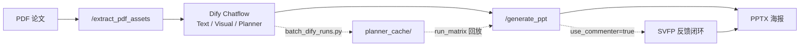

[English](README.md) | **简体中文**

# Paper-to-Poster Backend

> **当前版本：v5.1** · FastAPI 后端，为 Dify「论文 → 学术海报」**Chatflow** 提供解耦服务，并附带离线 **实验评测** 框架。

从 PDF 提取图文素材，接收 Dify 三 Agent（文本解析 / 视觉解析 / 规划）输出的结构化面板规划，渲染可编辑 PPTX 海报；可选 **SVFP 视觉反馈闭环**（VLM 评分 → 结构化修复 → 收敛留痕），并针对 Dify 长耗时场景提供 **异步 Job + 长轮询**。

**v5.1** 新增 **Dify 批跑脚本**（`batch_dify_runs.py`）、版本化的 Agent Prompt（`dify/prompts/`）、`planner_cache/` 规划快照回放，以及面向 **30 篇论文** 完整矩阵的 **L0→L8 实验流水线** 文档。

---

## 版本概览（v5.1）

| 模块 | 能力 |
|------|------|
| **Dify Chatflow** | 三 Agent 流水线（Text Parse → Visual Parse → Planner）；Prompt 见 `dify/prompts/`；设计说明见 `dify/DIFY_WORKFLOW_AND_PAPER_DESIGN.md` |
| **Dify 批跑** | `batch_dify_runs.py` 通过 Dify API 上传 PDF 并触发 Chatflow；支持自建 Dify + Chatflow `type: custom` 文件上传 |
| **规划回放** | Dify 运行产物 `outputs/runs/.../input.json` → 匹配 PDF → `planner_cache/<stem>.json`（`import_dify_runs.py`） |
| **PDF 资产** | `POST /extract_pdf_assets`：文本预览 + 插图，默认轻量 `image_url` |
| **PPT 渲染** | 4 套模板 × 4 套配色；`image_focus` 图主导布局 |
| **SVFP 闭环** | 结构化 issue/action；`FeedbackApplier` 路由；防横向布局退化 |
| **双阶段评审** | Pillow 快速预览 + VLM/启发式；LibreOffice 真 PPTX 截图再评 |
| **运行归档** | `outputs/runs/<timestamp>_<slug>_<runid>/`（含 `input.json`、`final.pptx`、`run_report.json`） |
| **异步接口** | `POST /generate_ppt`（202 + `job_id`）+ `GET /jobs/{job_id}?wait=20` 长轮询 |
| **实验框架** | 12 指标 × 5 基线；矩阵跑批、Judge、Bootstrap 统计（见 `experiments/README.md`） |

**演进主线**

- **v4.1**（2026-05-19 ~ 05-23）：SVFP 协议 → 输出目录统一 → LibreOffice 稳定性 → 异步 Job + 长轮询 → 布局质量收敛
- **v5.0**（2026-05-24）：实验框架落地 → JSONL 遥测 → 5 篇试点（3 基线 × 10 指标）
- **v5.1**（2026-05-25 ~ 05-26）：Dify 批跑自动化 → `dify/` Prompt 与设计文档 → **30 份 planner 快照** → 完整实验流水线（L0–L8）

---

## 实验流水线（L0 → L8）

```
[L0] PDF 论文           experiments/datasets/papers/*.pdf
        │  batch_dify_runs.py（触发 Dify Chatflow）
[L1] PosterTask 草稿    outputs/runs/<ts>_<slug>_<id>/input.json
        │  import_dify_runs.py（标题 ↔ PDF 匹配）
[L2] Planner 缓存       experiments/datasets/planner_cache/<stem>.json   ← 已缓存 30 份
        │  构建 papers_30.json
[L3] Paper Manifest     experiments/configs/papers_30.json
        │  run_matrix.py（30 篇 × 3 基线）
[L4] 渲染产物           experiments/results/artifacts/<baseline>_<stem>/
        │  compute_metrics.py
[L5] 指标分数           experiments/results/metrics/
        │  aggregate_stats.py
[L6] 汇总表             experiments/results/aggregate/{aggregate,pairwise}.tsv
        │  plot_figures.py / print_paper_table.py
[L7–L8] 论文图表与表格
```

逐步命令详见 [`INTERNAL_EXPERIMENT_GUIDE.md`](INTERNAL_EXPERIMENT_GUIDE.md)（维护者操作手册）。

**试点结果（n=5，v5.0）** — 仍可作为 sanity check：

| 指标 | ours_svfp | ours_no_svfp | gpt4o_zeroshot |
|------|-----------|--------------|----------------|
| B1 布局合理性 | **0.781** | 0.766 | 0.745 |
| B2 可读性 | **0.782** | 0.748 | 0.748 |
| D1 延迟 (ms) | 160,612 | **38** | 23,025 |

30 篇完整数据需在本地跑完 `run_matrix` → `compute_metrics` → `aggregate_stats` 后生成（结果目录已 gitignore）。

---

## 工作流



1. **`/extract_pdf_assets`**：提取文本与插图元数据（Dify 侧建议 `include_images=false`）。
2. **Dify Chatflow**：三 Agent 解析正文、分析图元数据、输出 `PosterTask` JSON。
3. **`/generate_ppt`**：异步生成 + 可选 SVFP；轮询 Job 后下载。
4. **实验**：回放冻结的 planner 快照，保证各基线使用**完全相同**的规划。

---

## 项目结构

```
poster_agent_backend/
├── app/                         # 生产 FastAPI 服务
│   ├── main.py                  # 路由与异步 Job（v5.1）
│   ├── models.py                # PosterTask  schema（Dify ↔ 渲染器契约）
│   ├── pdf_assets.py            # PDF 图文提取
│   ├── ppt_renderer.py          # PPTX 渲染
│   ├── feedback_loop.py         # SVFP 闭环 + 可选 JSONL 遥测
│   └── ...
├── dify/                        # Dify Chatflow 设计与 Agent Prompt
│   ├── DIFY_WORKFLOW_AND_PAPER_DESIGN.md
│   └── prompts/                 # text-parse / visual-parse / planner
├── experiments/                 # 离线批量评测
│   ├── baselines/               # ours_svfp, ours_no_svfp, gpt4o_zeroshot, …
│   ├── metrics/                 # A1–A4, B1–B3, C1–C3, D1–D3
│   ├── scripts/                 # batch_dify_runs, import_dify_runs, run_matrix, …
│   ├── datasets/
│   │   ├── papers/              # PDF（gitignore）
│   │   └── planner_cache/       # 冻结的 PosterTask 快照（可提交）
│   └── tools/                   # experiment_logger, run_analysis
├── tests/
├── INTERNAL_EXPERIMENT_GUIDE.md # L0–L8 完整操作手册
├── requirements.txt
├── experiments/requirements.txt
└── .env.example
```

---

## 环境要求

- **Python 3.12**（推荐）
- 可选：**LibreOffice**（`soffice`），Stage 2 真 PPTX 预览
- 可选：**DashScope API Key**，Qwen-VL 评审
- 实验额外：`pip install -r experiments/requirements.txt`
- Dify 批跑：自建或云端 Dify + `.env` 中配置 `DIFY_API_KEY`
- FastAPI 需被 Dify 容器访问（macOS Docker 常用 `http://host.docker.internal:8000`）

---

## 安装与启动

```bash
cd poster_agent_backend
python3.12 -m venv .venv312
source .venv312/bin/activate
pip install -r requirements.txt
cp .env.example .env           # 填写 DASHSCOPE_API_KEY、DIFY_*（批跑时需要）
python -m app.main
```

健康检查：`curl http://127.0.0.1:8000/health`

---

## API 一览

| 方法 | 路径 | 说明 |
|------|------|------|
| `GET` | `/health` | 服务状态 |
| `POST` | `/extract_pdf_assets` | 上传 PDF，返回 `asset_token` + 插图 URL |
| `POST` | `/generate_ppt` | **异步**生成（202 + `job_id`） |
| `GET` | `/jobs/{job_id}?wait=20` | 长轮询任务状态 |
| `POST` | `/generate_ppt_file` | **同步**生成（本地调试） |
| `GET` | `/download/run/{run_folder}` | 下载 `final.pptx` |
| `GET` | `/assets/{asset_token}/{filename}` | 访问提取的插图 |

---

## Dify 对接

### Chatflow 三 Agent

| Agent | Prompt 文件 | 职责 |
|-------|-------------|------|
| Text Parse | `dify/prompts/text-parseagent.txt` | 从 `text_preview` 提取章节与 bullet |
| Visual Parse | `dify/prompts/visual-parseagent.txt` | 基于 metadata-only 图列表做图文角色分配 |
| Planner | `dify/prompts/planneragent.txt` | 模板、配色、panels、figures → `PosterTask` JSON |

完整节点拓扑与设计理由见 [`dify/DIFY_WORKFLOW_AND_PAPER_DESIGN.md`](dify/DIFY_WORKFLOW_AND_PAPER_DESIGN.md)。

### 批量跑 30 篇

```bash
# 1. 启动后端（终端 1）
python -m app.main

# 2. 预览待跑 PDF 列表（终端 2）
python -m experiments.scripts.batch_dify_runs --limit 25 --skip-cached --dry-run

# 3. 批量触发 Chatflow（M3 Mac 约 145 秒/篇）
python -m experiments.scripts.batch_dify_runs --limit 25 --skip-cached

# 4. 导入 planner_cache
python -m experiments.scripts.import_dify_runs

# 5. 完整实验矩阵
python -m experiments.scripts.run_matrix --papers experiments/configs/papers_30.json --baselines ours_svfp,ours_no_svfp,gpt4o_zeroshot
python -m experiments.scripts.compute_metrics --all
python -m experiments.scripts.aggregate_stats --out experiments/results/aggregate/
python -m experiments.scripts.print_paper_table
```

**上传类型注意**：若 Chatflow Start 节点变量 `paper` 配置为 **「Other file types」**，API 需用 `"type": "custom"`（不是 `"document"`）——`batch_dify_runs.py` 已内置。

### 云端 / 隧道

云端 Dify 需 `ngrok http 8000` 或 `cloudflared tunnel`，Chatflow HTTP 节点指向公网 URL。

生成海报请走 **`POST /generate_ppt` + `GET /jobs/{job_id}`** 轮询，避免单次 HTTP 超过约 60 秒超时。

---

## 视觉反馈闭环（SVFP）

```json
{ "use_commenter": true, "max_iterations": 3 }
```

| Issue | 典型修复 |
|-------|----------|
| `overlapping_elements` | 减少 bullet、缩小字号 |
| `empty_space` | 放大字号、补内容 |
| `low_contrast` | 切换配色 |
| `figure_too_small` | 纵向面板切 `image_focus` |

单次运行分析：

```bash
python -m experiments.tools.run_analysis outputs/runs/<run_folder>/run_report.json
```

---

## 环境变量

| 变量 | 默认值 | 说明 |
|------|--------|------|
| `PORT` | `8000` | 服务端口 |
| `OUTPUT_DIR` | `outputs` | 输出根目录 |
| `DASHSCOPE_API_KEY` | （空） | Qwen-VL + 部分 Judge |
| `OPENAI_API_KEY` | （空） | 指标 Judge（OpenAI 兼容协议） |
| `QWEN_VL_MODEL` | `Qwen/Qwen2.5-VL-7B-Instruct` | VLM 模型 |
| `POSTER_EXPERIMENT_MODE` | `1`（`python -m app.main`） | JSONL 遥测；`0` 关闭 |
| `DIFY_API_KEY` | （空） | Chatflow 应用 Key（`app-…`） |
| `DIFY_BASE_URL` | `http://localhost/v1` | Dify API 地址 |
| `DIFY_WORKFLOW_INPUT_NAME` | `paper` | Start 节点 PDF 变量名 |
| `DIFY_USER_ID` | `experiment-batch` | Dify 用户标识 |
| `DIFY_QUERY` | 见 `.env.example` | Chatflow 必填 `query` 字段 |

---

## 测试

```bash
python -m pytest tests/ -q
python -m pytest experiments/tests/ -q
```

---

## 提交 GitHub 说明

**不会提交：** `.env`、`outputs/`、PDF、`experiments/.cache/`、metrics/aggregate/artifacts、vendor 基线、调试 PNG。

**会提交：** 源码、`dify/prompts/`、`experiments/datasets/planner_cache/`（30 份冻结规划快照）、configs、tests、文档。
