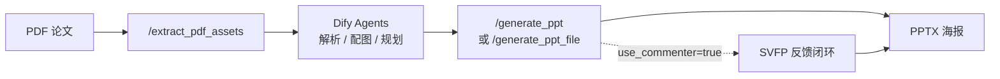

[English](README.md) | **简体中文**

# Paper-to-Poster Backend

> **当前版本：v4.1** · FastAPI 后端，为 Dify「论文 → 学术海报」工作流提供解耦服务。

从 PDF 提取图文素材，接收 Dify Planner 的结构化面板规划，渲染可编辑的 PPTX 海报；可选 **SVFP 视觉反馈闭环**（VLM 评分 → 结构化修复 → 收敛留痕），并针对 Dify 长耗时场景提供 **异步 Job + 长轮询**。

---

## 版本概览（v4.1）

| 模块 | 能力 |
|------|------|
| **PDF 资产** | `POST /extract_pdf_assets`：文本预览 + 插图提取，默认落盘 `static/assets/{asset_token}/`，返回轻量 `image_url` |
| **PPT 渲染** | 4 套模板 × 4 套配色；支持 `image_focus` 图主导布局、纵向挤压检测 |
| **SVFP 闭环** | 结构化 issue/action（含 `figure_too_small`）；`FeedbackApplier` 路由修复；防横向布局退化 |
| **双阶段评审** | Stage 1：Pillow 快速预览 + VLM/启发式；Stage 2：LibreOffice 真 PPTX 截图再评（独立 profile，避免 `soffice exit=-6`） |
| **运行归档** | 单次运行统一写入 `outputs/runs/<timestamp>_<slug>_<runid>/`（`input.json`、`final.pptx`、`run_report.json`、迭代预览图） |
| **异步接口** | `POST /generate_ppt` 立即返回 `job_id`（HTTP 202）；`GET /jobs/{job_id}?wait=20` 服务端长轮询，适配 Dify 无 sleep 的循环节点 |
| **下载体验** | `GET /download/run/{run_folder}` 按论文标题生成可读文件名 |

演进主线（2026-05-19 ~ 05-23）：SVFP 协议落地 → 输出目录统一 → demo 清理 → LibreOffice 稳定性 → 异步 Job + 长轮询 → 去占位/图标 → 可读下载名 → **布局质量收敛**（`image_focus` + 防反馈退化）。详见仓库内 `PROJECT_CONVERSATION_SUMMARY.md`。

---

## 工作流



1. **`/extract_pdf_assets`**：提取文本预览与插图元数据（`include_images=false` 时适合 Dify，避免超大 base64）。
2. **Dify**：解析正文、分析图表、规划 `panels` / `figures` / 模板与配色。
3. **`/generate_ppt`**（推荐 Dify）：异步生成，轮询 Job 状态后下载。
4. **`/generate_ppt_file`**（本地调试）：同步跑完整流程，直接返回 `download_url` 与反馈轨迹。

---

## 项目结构

```
poster_agent_backend/
├── app/
│   ├── main.py              # FastAPI 入口与路由（v4.1）
│   ├── pdf_assets.py        # PDF 图文提取
│   ├── ppt_renderer.py      # PPTX 渲染（模板 / 主题 / image_focus）
│   ├── feedback_loop.py     # 视觉反馈闭环 + LibreOffice 截图
│   ├── vlm_commenter.py     # SVFP 协议 + Qwen-VL 评审
│   ├── job_store.py         # 异步任务状态（内存，进程内有效）
│   ├── run_archive.py       # runs 目录归档
│   ├── run_analysis.py      # run_report 实验分析 CLI
│   └── ...
├── tests/                   # SVFP 等单元测试
├── static/assets/           # 提取的 PDF 插图
├── outputs/runs/            # 每次生成的完整运行记录
├── requirements.txt
└── .env.example
```

---

## 环境要求

- **Python 3.12**（推荐；3.13 在 macOS 上可能迫使 PyMuPDF 源码编译，慢且易失败）
- 可选：**LibreOffice**（`soffice`），用于 Stage 2 真实 PPTX 预览图
- 可选：**DashScope API Key**，启用 Qwen-VL 结构化评审；未配置时自动回退启发式规则

---

## 安装与启动

```bash
cd poster_agent_backend
python3.12 -m venv .venv312
source .venv312/bin/activate   # Windows: .venv312\Scripts\activate
pip install -r requirements.txt
cp .env.example .env           # 按需填写 DASHSCOPE_API_KEY
python -m app.main
```

健康检查：

```bash
curl http://127.0.0.1:8000/health
```

---

## API 一览

| 方法 | 路径 | 说明 |
|------|------|------|
| `GET` | `/health` | 服务状态 |
| `POST` | `/extract_pdf_assets` | 上传 PDF 或 `pdf_url`，返回 `asset_token` + 插图 URL |
| `POST` | `/generate_ppt` | **异步**生成（202 + `job_id`），适合 Dify |
| `GET` | `/jobs/{job_id}?wait=20` | 查询任务；`wait` 0–50s 长轮询至完成/失败 |
| `POST` | `/generate_ppt_file` | **同步**生成（本地调试 / 短任务） |
| `GET` | `/download/run/{run_folder}` | 下载 `final.pptx`（文件名基于论文标题） |
| `GET` | `/assets/{asset_token}/{filename}` | 访问提取的插图 |

---

## 快速测试

### 提取 PDF 资产

```bash
curl -X POST "http://127.0.0.1:8000/extract_pdf_assets" \
  -F "file=@/path/to/paper.pdf"
```

默认 `include_images=false`：图片存于 `static/assets/{asset_token}/`，响应只含 `image_url` / `thumbnail_url`。

### 异步生成（Dify 推荐）

```bash
# 1. 提交任务
curl -X POST "http://127.0.0.1:8000/generate_ppt" \
  -H "Content-Type: application/json" \
  -d @tests/test_payload_feedback.json

# 响应示例：{"job_id":"...","status":"pending","status_url":"/jobs/..."}

# 2. 长轮询直到完成（默认 wait=20s，可重复调用）
curl "http://127.0.0.1:8000/jobs/<job_id>?wait=30"

# 3. 下载（使用 result.download_url）
curl -OJ "http://127.0.0.1:8000/download/run/<run_folder>"
```

### 同步生成（本地）

```bash
curl -X POST "http://127.0.0.1:8000/generate_ppt_file" \
  -H "Content-Type: application/json" \
  -d @tests/test_payload_feedback.json
```

---

## 视觉反馈闭环（SVFP）

在 Planner JSON 中开启：

```json
{
  "use_commenter": true,
  "max_iterations": 3
}
```

**两阶段评审**

- **Stage 1**：Pillow 快速预览 PNG → VLM 结构化反馈（SVFP）或启发式回退
- **Stage 2**：若已安装 LibreOffice，将真实 PPTX 转为 PNG 再评一轮

**SVFP 问题类型**（`vlm_commenter.py`）

| Issue | 典型修复动作 |
|-------|----------------|
| `overlapping_elements` | 减少 bullet、缩小字号 |
| `empty_space` | 放大字号、补内容 |
| `low_contrast` | 切换配色主题 |
| `figure_too_small` | 纵向面板切 `image_focus`；横向布局忽略此项以防退化 |

未配置 `DASHSCOPE_API_KEY` 或 VLM 不可用时，回退启发式：文字溢出、内容过密、空白过多、图文不匹配等。

**运行分析**（论文实验 / 消融）：

```bash
python -m app.run_analysis outputs/runs/<run_folder>/run_report.json
```

输出分数曲线、重复 issue、动作统计与改进建议。

---

## 模板与配色

Planner JSON 字段示例：

```json
{
  "template": "template_dashboard",
  "color_theme": "academic_blue",
  "layout_variant": "auto",
  "emphasis_level": "normal"
}
```

**模板**

| 名称 | 适用场景 |
|------|----------|
| `template_dashboard` | 六区仪表盘，中心面板突出；方法/基准类论文 |
| `template_classic` | 经典三栏均衡布局；标准实验论文 |
| `template_storyflow` | 横向六步叙事；流程/系统类论文 |
| `template_minimal` | 高留白卡片式；概念/综述摘要 |

**配色**：`academic_blue`、`engineering_green`、`warm_orange`、`minimal_gray`

**布局 hint**（面板级）：`text_only`、`text_top_image_bottom`、`text_left_image_right`、`image_focus`、`image_compact` 等；反馈循环会自动调整 `layout_hint` 与 `body_font_scale`。

---

## 环境变量

| 变量 | 默认值 | 说明 |
|------|--------|------|
| `PORT` | `8000` | 服务端口 |
| `OUTPUT_DIR` | `outputs` | 输出根目录 |
| `DASHSCOPE_API_KEY` | （空） | 阿里云 DashScope，启用 Qwen-VL |
| `QWEN_VL_MODEL` | `Qwen/Qwen2.5-VL-7B-Instruct` | VLM 模型名 |

---

## Dify 云端对接

本地服务需对公网暴露，例如：

```bash
ngrok http 8000
# 或
cloudflared tunnel --url http://localhost:8000
```

在 Dify HTTP 节点中使用公网 URL。生成海报请走 **`POST /generate_ppt` + `GET /jobs/{job_id}`** 轮询，避免同步等待超过 HTTP 节点超时（约 60s）导致重复提交。

完成后的 `result` 含 `download_url`、`filename`（可读论文标题）、`best_score`、`iterations`、`converged`、`convergence_reason`。

---

## 测试

```bash
python -m pytest tests/ -q
```

---

## 许可证

见仓库根目录（如适用）。
