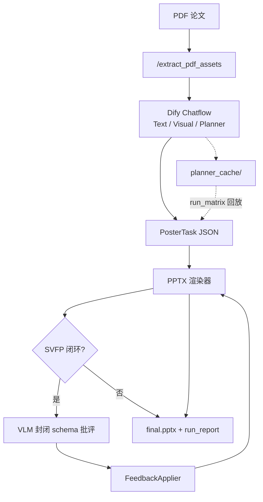

[English](README.md) | **简体中文**

# PosterCSP — Paper-to-Poster Backend

> **当前版本：v5.3** · FastAPI 后端 + **SVFP**（Structured Visual Feedback Protocol，结构化视觉反馈协议）+ 可复现的 **CS-Poster-30** 评测框架。

给定一篇 CS 论文 PDF，系统通过 Dify **Chatflow**（内容规划）与 Python 渲染器（可选 **SVFP 闭环**：VLM 批评 → 确定性修复 → 收敛留痕）生成可编辑的 A3 学术海报 PPTX。长耗时任务采用 **异步 HTTP + 服务端长轮询**，适配 Dify。

**研究方向（v3）：** SVFP 仍是主贡献；当前已补齐 E1/E2 预检链路、VLM 延迟边界、图抽取过滤与协议级指标。当前状态与后续优化见 [`RESEARCH_DIRECTION_v3.md`](RESEARCH_DIRECTION_v3.md)。

---

## 项目定位（能说什么 / 不能说什么）

| | |
|---|---|
| **是** | 一种 **planner-agnostic** 的结构化视觉反馈协议（4 类 issue × 9 个原子动作），可挂在任意 poster planner 之后 |
| **是** | 可复现的 **CS-Poster-30** 流水线（30 份冻结规划快照、headline/appendix/protocol 指标、L0→L8 脚本） |
| **不是** | 「结构化规划在内容召回上优于 zero-shot」（试点：a1 低于 gpt4o_zeroshot） |
| **不是** | 「SVFP 比无反馈更快」的系统；当前应写成质量-延迟 Pareto |
| **不是** | 「100% 原图复用」的已证结论；图抽取已加过滤和审计，但复用率仍需正式度量 |

**一句话定位（论文用）：**

> 我们提出 **SVFP**——将 VLM 视觉批评约束到 `{4 类问题 × 9 个动作}` 封闭 schema，并由确定性 `FeedbackApplier` 执行，使反馈可执行、可收敛。在 CS-Poster-30 上，SVFP 在视觉质量（B1/B2，n=5 时 Cohen's d ≈ 1.8）取得大效应提升，并诚实报告内容 precision–recall trade-off。

---

## 版本概览（v5.3）

| 模块 | 能力 |
|------|------|
| **SVFP 协议** | 4 类 root-cause issue × 9 确定性 action；可配置收敛；VLM 调用有 timeout/硬超时边界 |
| **E1 基线** | `ours_freeform` — 自由文本 VLM 批评 + LLM best-effort 改写；失败记录为不可执行反馈，不再让 cell 崩溃 |
| **E2 基线** | `gpt4o_zeroshot_svfp` — zero-shot planner 后接 SVFP，用于验证 planner-agnostic |
| **A3 修复** | NLI 幻觉：中立/弃权不再误判为幻觉；拆分 `contradicted_rate` 与 `unsupported_rate` |
| **图 pipeline** | PDF 抽图过滤低信息图片，记录 xref/bbox 元数据，并支持 VLM 图审计 |
| **Planner 缓存** | 30 份冻结 `PosterTask`；错图引用清理；`clean_planner_cache.py` |
| **Dify Chatflow** | 三 Agent 流水线；Prompt 见 `dify/prompts/` |
| **批跑** | `batch_dify_runs.py` 通过 API 批量触发 Chatflow |
| **渲染器** | 4 模板 × 4 主题；六模块 CS domain prior；异步 Job + 运行归档 |
| **实验** | 基线：`ours_svfp` · `ours_no_svfp` · `ours_freeform` · `gpt4o_zeroshot` · `gpt4o_zeroshot_svfp` · 外部 SOTA（可选） |

**演进主线**

- **v4.1**：SVFP 协议、异步 Job、布局质量守卫
- **v5.0**：实验框架、5 篇试点、JSONL 遥测
- **v5.1**：Dify 批跑、30 份 planner 快照、L0→L8 文档
- **v5.2**：研究重锚（PosterCSP / SVFP 脊柱）、E1 free-form 基线、A3 指标修复、图审计 + planner 清理
- **v5.3**：VLM 延迟边界、PDF 图过滤、协议级指标、E1 smoke、E2 cross-planner baseline、v3 规划文档

---

## 试点结论（n=5，诚实摘要）

来自 15 个 metrics JSON（5 篇 × 3 方法）的均值。**n=5 下 BH-FDR 校正后无一显著**——仅作方向性参考。

| 类别 | 指标 | gpt4o_zeroshot | ours_no_svfp | ours_svfp | 解读 |
|------|------|----------------|--------------|-----------|------|
| 内容 | A1 信息保留 | **0.544** | 0.448 | 0.448 | 结构化规划牺牲召回 |
| 内容 | A3 幻觉率 | 0.117 | **0.100** | 0.117 | 无明显赢家（v5.2 已修 A3 逻辑） |
| 视觉 | B1 布局 | 0.745 | 0.766 | **0.781** | SVFP 最清晰赢点 |
| 视觉 | B2 可读性 | 0.748 | 0.748 | **0.782** | 同 B1 模式 |
| 工程 | D1 延迟 (ms) | 23,025 | **38** | 160,612 | 质量–延迟 trade-off |
| 工程 | D2 成本 ($) | **0.004** | 0 | 0.012 | 多轮 VLM 成本 |

**历史 pilot 注记：** 原始 n=5 pilot 中 `ours_svfp` 与 `ours_no_svfp` 内容指标相同，因为当时闭环几乎只改排版。v5.3 已把 `reduce_bullet_count` 改为内容保留式合并，因此新的内容指标必须重算后再下结论。

**当前状态：** E1/E2 预检链路已实现并 smoke-tested。正式 n=30、独立视觉验证、E3 消融、人评、外部 SOTA 仍未完成。见 [`RESEARCH_DIRECTION_v3.md`](RESEARCH_DIRECTION_v3.md)。

---

## 架构



1. **`/extract_pdf_assets`** — 文本预览 + 插图元数据。
2. **Dify Chatflow** — 三 Agent 输出 `PosterTask` JSON。
3. **渲染器 + 可选 SVFP** — 确定性布局修复闭环。
4. **实验** — 回放冻结规划，各基线在**相同规划**上对比。

---

## 项目结构

```
poster_agent_backend/
├── app/                         # 生产 FastAPI + SVFP + 渲染器
├── dify/                        # Chatflow 设计与 Agent Prompt
├── experiments/
│   ├── baselines/               # ours_svfp, ours_no_svfp, ours_freeform, …
│   ├── metrics/                 # 内容、视觉、协议、用户/待补、工程指标
│   ├── scripts/                 # batch_dify_runs, run_matrix, audit_figures, …
│   └── datasets/planner_cache/  # 30 份冻结 PosterTask 快照
├── RESEARCH_DIRECTION_v3.md     # 当前技术状态与下一步优化计划
├── INTERNAL_EXPERIMENT_GUIDE.md # L0→L8 逐步操作手册
└── .env.example
```

---

## 快速开始

```bash
cd poster_agent_backend
python3.12 -m venv .venv312 && source .venv312/bin/activate
pip install -r requirements.txt
cp .env.example .env          # 填写 DASHSCOPE_API_KEY、DIFY_*（批跑时）
python -m app.main
curl http://127.0.0.1:8000/health
```

---

## API 一览

| 方法 | 路径 | 说明 |
|------|------|------|
| `GET` | `/health` | 服务状态 |
| `POST` | `/extract_pdf_assets` | PDF → `asset_token` + 插图 URL |
| `POST` | `/generate_ppt` | 异步生成（202 + `job_id`） |
| `GET` | `/jobs/{job_id}?wait=20` | 长轮询任务状态 |
| `POST` | `/generate_ppt_file` | 同步生成（调试） |
| `GET` | `/download/run/{run_folder}` | 下载 `final.pptx` |
| `GET` | `/assets/{asset_token}/{filename}` | 提取的插图 |

---

## SVFP 协议

在 Planner JSON 中开启：

```json
{ "use_commenter": true, "max_iterations": 3 }
```

| Issue | 典型确定性修复 |
|-------|----------------|
| `overlapping_elements` | 减少 bullet、缩小字号 |
| `empty_space` | 放大字号、重平衡留白 |
| `low_contrast` | 切换配色（2 色守卫） |
| `figure_too_small` | 纵向面板 → `image_focus` |

单次运行分析：

```bash
python -m experiments.tools.run_analysis outputs/runs/<run_folder>/run_report.json
```

---

## 实验

**基线对照**

| 名称 | 隔离变量 |
|------|----------|
| `ours_svfp` | 完整 SVFP 闭环 |
| `ours_no_svfp` | 同渲染器、无反馈（布局消融） |
| `ours_freeform` | 自由文本 VLM 批评 + LLM 改写（E1 臂） |
| `gpt4o_zeroshot` | 仅 LLM 规划，同渲染器与同模板 |
| `gpt4o_zeroshot_svfp` | zero-shot planner + SVFP 后处理（E2 臂） |

**完整矩阵（本地）**

```bash
python -m experiments.scripts.run_matrix \
  --papers experiments/configs/papers_30.json \
  --baselines ours_no_svfp,ours_freeform,ours_svfp,gpt4o_zeroshot_svfp
python -m experiments.scripts.compute_metrics --all
python -m experiments.scripts.aggregate_stats --out experiments/results/aggregate/
python -m experiments.scripts.print_paper_table
```

**图污染体检（B1 诊断）**

```bash
python experiments/scripts/audit_figures.py --dry-run   # 不调 API
python experiments/scripts/audit_figures.py --limit 3   # 小规模验证
```

详见 [`experiments/README.md`](experiments/README.md) · [`INTERNAL_EXPERIMENT_GUIDE.md`](INTERNAL_EXPERIMENT_GUIDE.md)

---

## 环境变量

| 变量 | 说明 |
|------|------|
| `DASHSCOPE_API_KEY` | Qwen-VL 评审 + Judge |
| `OPENAI_API_KEY` | 指标 Judge（OpenAI 兼容） |
| `POSTER_EXPERIMENT_MODE` | `1` = 每次运行写 JSONL 遥测 |
| `POSTER_LLM_TIMEOUT_S` | 文本/VLM SDK 请求 timeout |
| `POSTER_VLM_WALL_TIMEOUT_S` | SVFP VLM 审查硬超时 |
| `POSTER_VLM_ALLOW_FALLBACK` | 实验中设 `0`，避免第二次非 JSON VLM 长调用 |
| `DIFY_API_KEY` / `DIFY_BASE_URL` | 批量触发 Chatflow |
| `DIFY_WORKFLOW_INPUT_NAME` | Start 节点 PDF 变量名（默认 `paper`） |

完整列表见 [`.env.example`](.env.example)。

---

## 测试

```bash
python -m pytest tests/ -q
python -m pytest experiments/tests/ -q
```

---

## 文档地图

| 文档 | 读者 | 内容 |
|------|------|------|
| **README**（本文） | 新克隆者 | 概览、快速开始、诚实试点摘要 |
| [`RESEARCH_DIRECTION_v3.md`](RESEARCH_DIRECTION_v3.md) | 论文作者 | 当前状态、剩余风险、下一步优化计划 |
| [`RESEARCH_DIRECTION_v2.md`](RESEARCH_DIRECTION_v2.md) | 论文作者 | 历史 v2 转向与原始 backlog |
| [`INTERNAL_EXPERIMENT_GUIDE.md`](INTERNAL_EXPERIMENT_GUIDE.md) | 操作者 | L0→L8 命令与避坑 |
| [`dify/DIFY_WORKFLOW_AND_PAPER_DESIGN.md`](dify/DIFY_WORKFLOW_AND_PAPER_DESIGN.md) | 方法章节 | Chatflow 拓扑与 Agent 设计 |

---

## GitHub 说明

**不会提交：** `.env`、`outputs/`、PDF、`experiments/.cache/`、metrics/aggregate/artifacts、`PAPER_DRAFT_v0.md`、内部对话记录。

**会提交：** 源码、`dify/prompts/`、`planner_cache/`（30 份快照）、`RESEARCH_DIRECTION*.md`、configs、tests。
